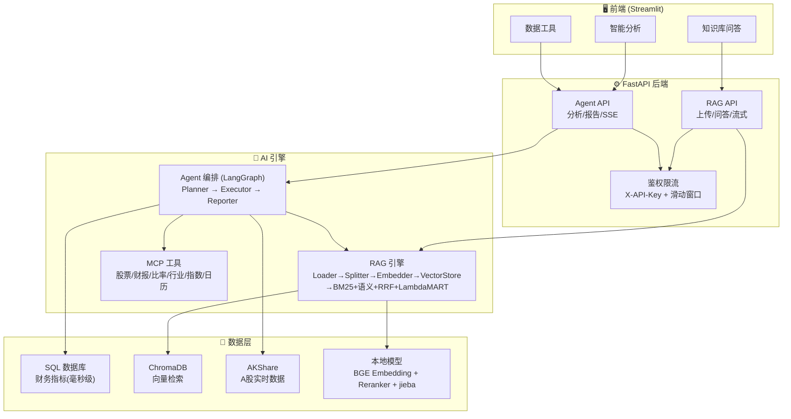
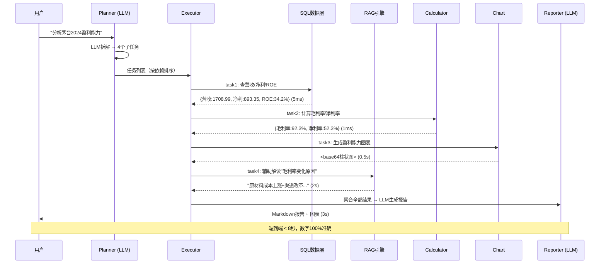
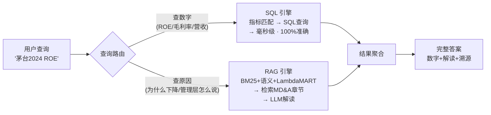

# 智能财务分析平台 — 系统架构图 (V8.0)

> 更新日期：2026-07-09
> 核心理念：SQL 优先查数字，RAG 辅助解读文本

---

## 一、整体架构

---

## 二、Agent 执行流程（核心链路）

---

## 三、数据查询双引擎

---

## 四、技术栈

| 层级 | 选型 | 说明 |
|------|------|------|
| **LLM** | DeepSeek v4-flash / v4-pro | flash=简单提取，pro=复杂推理+报告 |
| **Embedding** | BAAI/bge-base-zh-v1.5 (768维) | 本地免费，中文SOTA |
| **Reranker** | BAAI/bge-reranker-v2-m3 | 本地免费 |
| **向量库** | ChromaDB (HNSW) | 轻量免运维 |
| **分词** | jieba + 138财务术语词典 | 精确模式 |
| **Agent框架** | LangGraph StateGraph | 业界标准编排 |
| **数据源** | AKShare + SQLite | A股免费数据 |
| **后端** | FastAPI + SSE | 流式响应 |
| **前端** | Streamlit | 快速原型 |
| **容器化** | Docker + docker-compose | 生产部署 |
