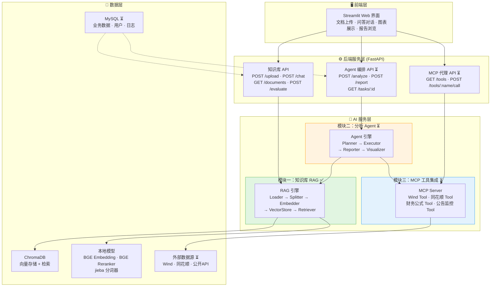
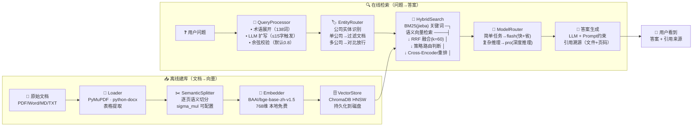
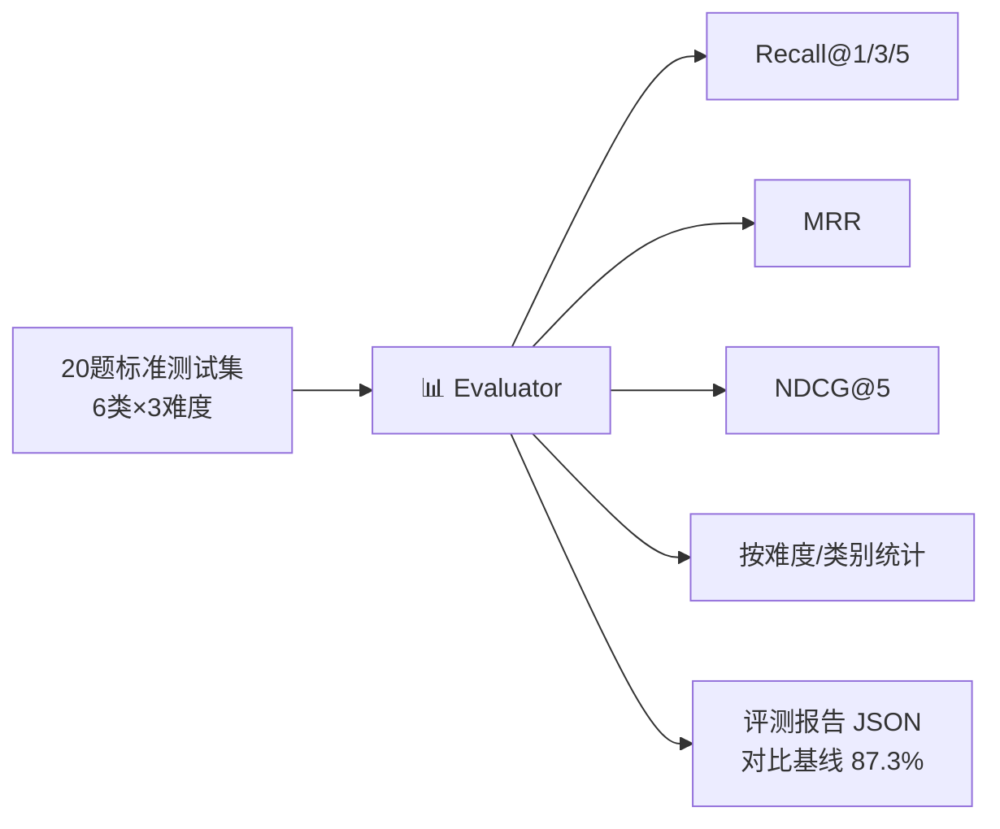
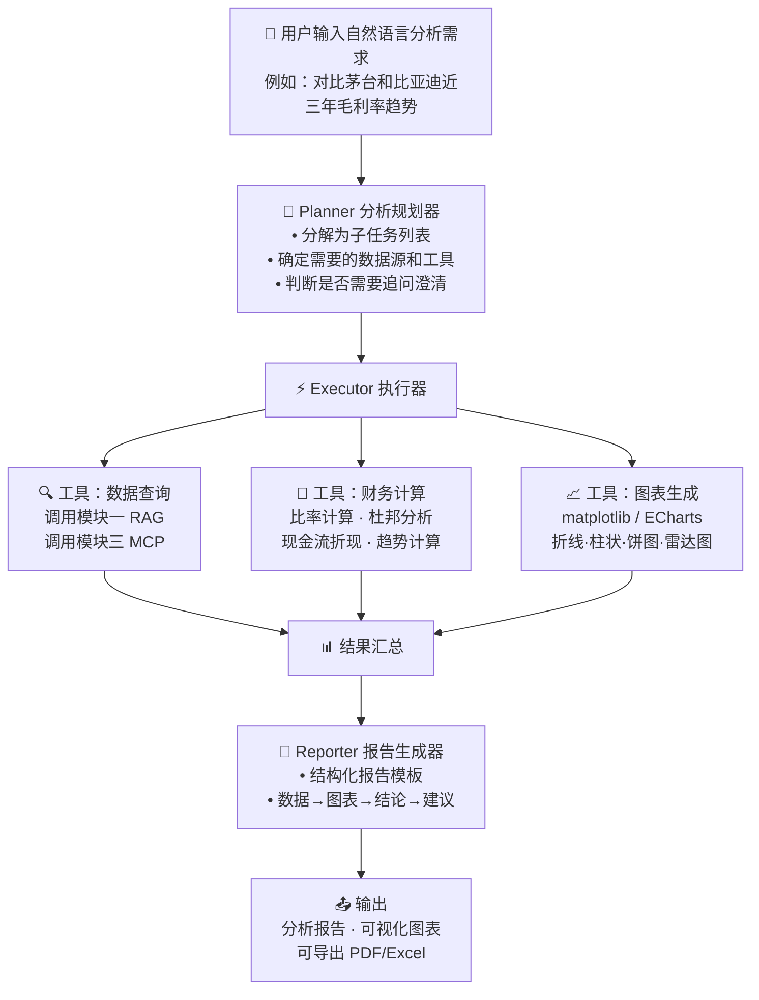
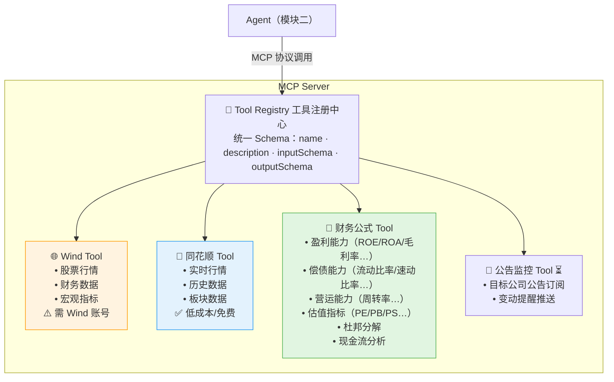
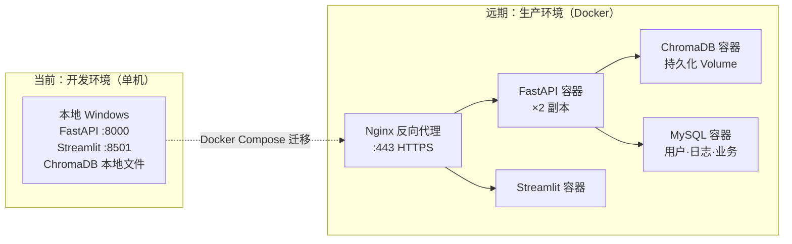
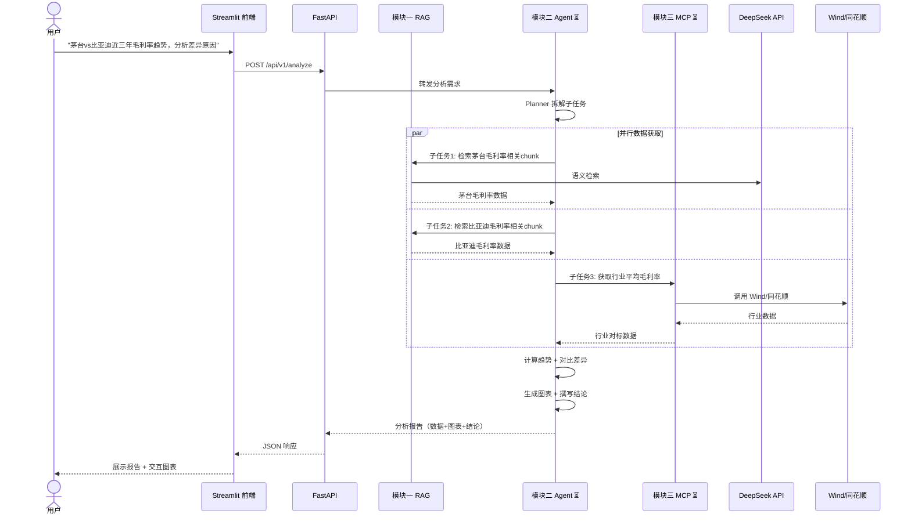

# 智能财务分析平台 — 系统架构图

> 日期：2026-07-01
> 基于 BRD V1.1 三模块架构

---

## 一、整体系统架构（三大模块全景）



---

## 二、模块一：知识库 RAG Pipeline（已实现 ✅）



### 评测回路



---

## 三、模块二：数据分析 Agent（规划中 ⏳）



---

## 四、模块三：MCP 工具集成（规划中 ⏳）



---

## 五、部署架构（当前 vs 远期）



---

## 六、数据流全链路（端到端）



---

## 七、文件目录结构映射

```
financial-ai-platform/
│
├── frontend/                  # 🖥️ Streamlit 前端
│   └── app.py
│
├── backend/                   # ⚙️ FastAPI 后端
│   ├── main.py                # 服务入口
│   ├── config.py              # 全局配置（读 .env）
│   ├── api/
│   │   └── rag.py             # 模块一 API 路由
│   ├── models/
│   │   └── schemas.py         # Pydantic 数据模型
│   └── rag/                   # 模块一 RAG 引擎
│       ├── loader.py          #   文档加载
│       ├── semantic_splitter.py # 语义切分
│       ├── embedder.py        #   向量化
│       ├── vector_store.py    #   ChromaDB 管理
│       ├── hybrid_search.py   #   混合检索 + RRF + 重排
│       ├── query_processor.py #   Query 处理
│       ├── entity_router.py   #   实体路由
│       ├── jieba_tokenizer.py #   中文分词 + 财务词典
│       ├── model_router.py    #   LLM 调用路由
│       ├── retriever.py       #   检索入口
│       ├── evaluator.py       #   评测体系
│       └── experiments.py     #   参数实验
│
├── data/
│   ├── documents/             # 📄 原始文档
│   ├── chroma_db/             # 🗄️ ChromaDB 持久化
│   ├── models/                # 🧠 本地模型（BGE）
│   └── test_questions.json    # 📊 标准测试集
│
├── scripts/
│   └── rebuild_index.py       # 🔧 重建索引脚本
│
├── docs/
│   ├── BRD-业务需求说明书.md   # 📋 业务需求
│   └── 架构图.md              # 🏗️ 架构文档（本文件）
│
├── requirements.txt           # 📦 Python 依赖
├── .env.example               # 🔑 环境变量模板
├── README.md                  # 📖 项目说明
├── PROGRESS.md                # 📊 进度存档
└── CLAUDE.md                  # 🤖 项目约束
```
